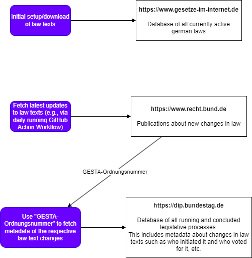

# gesetze-crawler

## Quickstart

```{bash}
git clone https://github.com/Chrizey91/gesetze-crawler.git
cd gesetze-crawler
uv lock
uv sync
uv run python src/gesetze_crawler gii GG test-dir
```

## Testing

```{bash}
uv run python -m pytest
```

## Packaging
Increase version in `pyproject.toml`
```{bash}
rm -r dist
uv build
twine upload --repository testpypi dist/*
```

## Architecture Proposal

